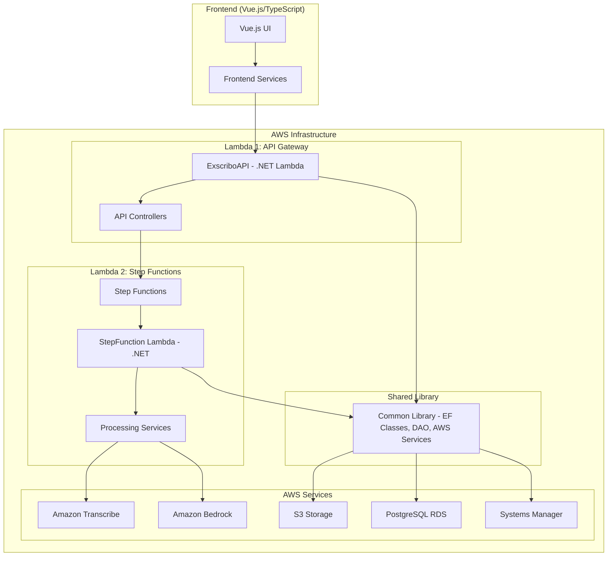
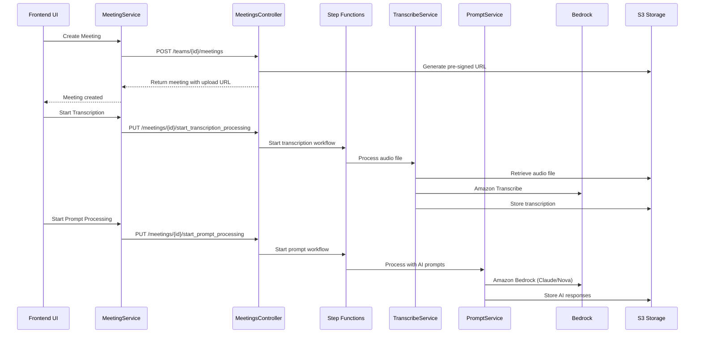

# Exscribo - AI-Powered Meeting Transcription Platform

A comprehensive AWS-based platform for meeting recording, transcription, and AI-powered analysis using Amazon Bedrock, Transcribe, and Step Functions.

## Architecture Overview



## Project Structure

```
exscribo/
├── backend/                    # .NET Backend Services (2 Lambda Codebases)
│   ├── Common/                 # Central shared library
│   │   ├── AWSServices/        # AWS service integrations
│   │   ├── DAO/               # Data access objects & EF classes
│   │   ├── Types/             # Common data types
│   │   ├── ApplicationDbContext.cs  # Entity Framework context
│   │   └── Database interactions & utilities
│   ├── ExscriboAPI/           # Lambda #1: API Gateway requests
│   │   └── Controllers/       # REST API controllers
│   └── StepFunctionLambda/    # Lambda #2: Step Function state updates
│       └── Services/          # Background processing services
├── frontend/                  # Vue.js Frontend Application
│   └── src/
│       ├── services/          # API service clients
│       ├── views/             # Vue components/pages
│       └── types/             # TypeScript type definitions
└── cdk/                      # AWS CDK Infrastructure
```

## API Flow & Relationships

### Meeting Processing Workflow



### Frontend-Backend Service Mapping

| Frontend Service | Backend Controller | Primary Functions |
|-----------------|-------------------|-------------------|
| `meeting.service.ts` | `MeetingsController.cs` | CRUD operations, transcription, AI processing |
| `team.service.ts` | `TeamsController.cs` | Team management |
| `customModel.service.ts` | `CustomModelsController.cs` | Custom model training |
| `customVocabulary.service.ts` | `CustomVocabolariesController.cs` | Vocabulary management |
| `meetingDocuments.service.ts` | `MeetingDocumentsController.cs` | Document handling |
| `meetingassistant.service.ts` | `ChatBotController.cs` | AI assistant interactions |

## Core Components

### Backend Architecture (2 Lambda Codebases)

#### Common Library (`Common/`)
Central shared library containing:
- **Entity Framework Classes**: Database models and DbContext
- **DAO Layer**: Data access objects for database interactions
- **AWS Service Integrations**: Bedrock, S3, Transcribe clients
- **Common Types**: Shared data structures and enums
- **Utilities**: Helper classes and configuration management

#### Lambda #1: API Gateway Handler (`ExscriboAPI/`)
- **Purpose**: Handles HTTP requests from frontend
- **Controllers**: REST API endpoints for CRUD operations
- **Dependencies**: References Common library for data access

#### Lambda #2: Step Function Processor (`StepFunctionLambda/`)
- **Purpose**: Processes Step Function state machine events
- **Services**: Background processing (transcription, AI analysis)
- **Dependencies**: References Common library for AWS integrations

### Frontend Services (`frontend/src/services/`)

#### Core API Services
```typescript
// Meeting management
MeetingService.createMeeting(teamId, meetingData)
MeetingService.startTranscriptionProcessing(teamId, meetingId)
MeetingService.startPromptProcessing(teamId, meetingId)

// AI Assistant
MeetingAssistantService.submitQuestion(teamId, meetingId, question)
```

## Key Features

### 1. Meeting Lifecycle Management
- **Creation**: Initialize meeting with metadata
- **Upload**: Secure S3 pre-signed URL generation
- **Transcription**: Amazon Transcribe integration
- **AI Analysis**: Bedrock-powered content analysis
- **Finalization**: Meeting sealing and archival

### 2. AI-Powered Features
- **Transcription**: High-accuracy speech-to-text
- **Summarization**: AI-generated meeting summaries
- **Action Items**: Automated task extraction
- **Q&A Assistant**: Interactive meeting analysis

### 3. Customization Options
- **Custom Models**: Tailored transcription models
- **Vocabularies**: Domain-specific terminology
- **Prompt Sets**: Configurable AI analysis templates

## Deployment

The application uses AWS CDK for infrastructure deployment:

```bash
# Backend deployment
cd backend
./build.sh

# Frontend deployment  
cd frontend
npm run build

# Infrastructure deployment
cd cdk
cdk deploy
```

## Security Features

- **SSL Enforcement**: All S3 buckets require HTTPS
- **IAM Roles**: Least-privilege access controls
- **VPC**: Network isolation and security
- **Encryption**: KMS encryption for data at rest
- **Pre-signed URLs**: Secure file upload/download

## Data Flow


## Use Cases

- **Corporate Meetings**: Automated note-taking and action item extraction
- **Training Sessions**: Content analysis and key point identification  
- **Interviews**: Structured transcription and analysis
- **Conferences**: Multi-speaker transcription with AI insights

## Important Notice

This is a prototype/demo platform showcasing AWS services for recording transcription and GenAI use cases. The project serves as an example implementation and is not intended for production use without proper security hardening and optimization.

## License

Copyright © Amazon.com and Affiliates. This deliverable is considered Developed Content as defined in the AWS Service Terms.